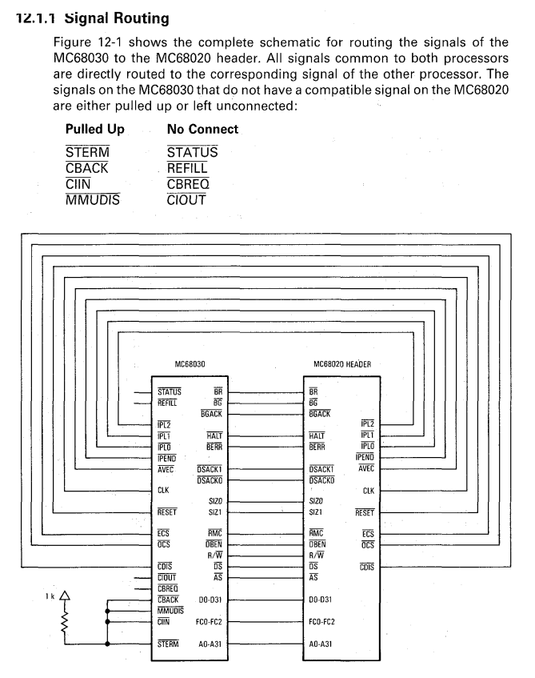

# 68030 to 68020 adapter

Barebones adapter for Motorola processors, converting 68030 to 68020. There is no logic in this, and all the extra features of the 68030 are disabled.

# Why was this made?

To be used with [https://rosco-m68k.com/](https://rosco-m68k.com/) 68020 SBC to test CPUs bought off eBay. Didn't want to buy both the '20 and the '30 version, and now I can test (to a large degree) both versions. The MMU isn't getting tested, but in practice the chips either all work or fail completely to even come up, so it met it's goal.

# Headers and socket

You can buy those off sites like DigiKey or eBay.

For the plug-in 68020 side I used 2.54 mm Single Row Male Pin Headers that I cut up to fill in the rows/columns as needed. They need to be aligned really well otherwise it's close to impossible to plug them into a socket. I used one of the non-populated boards (got 3 made for corrections, test, etc) to hold the pins in place in the right way, but you can also use a 68020 socket and get the same effect. The latter might be too much of a heat sink though, making soldering hard.

The 68030 side is just a regular 128 Pin Machine Pin Grid Array PGA IC Socket.

